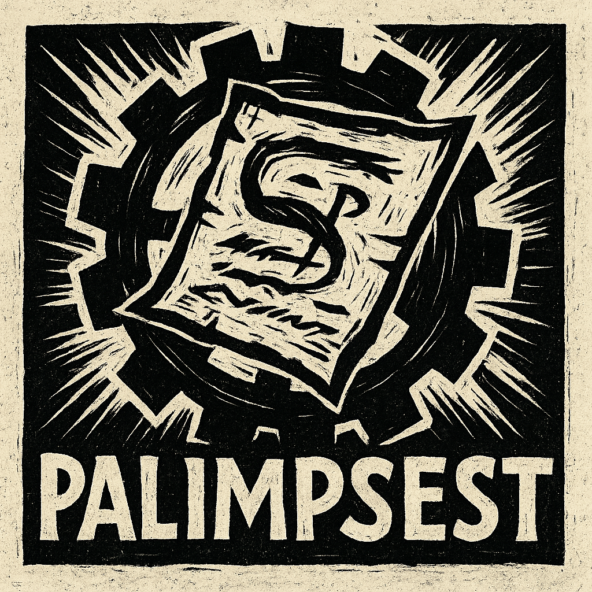

# Palimpsest Engine

<p align="center">
  <a href="https://palimpsest.org">
    
  </a>
</p>

## Consciousness-Driven CRPG Engine

**[Palimpsest Engine](https://palimpsest.org) is a specialized CRPG development platform built for creating Disco Elysium-style narrative games.** Based on the proven Godot Engine foundation, Palimpsest adds consciousness mechanics, bureaucratic systems, and German Expressionist aesthetics to create immersive psychological RPGs where thoughts reshape reality.

Palimpsest transforms traditional game development by making **mental states physically affect the game world** through consciousness fields that distort architecture, alter NPC behavior, and influence procedural generation.

## Key Features

### 🧠 Consciousness Field System
- **8 Consciousness Types**: Depression, Anxiety, Anger, Memory, Bureaucratic, Creative, Fear, Hope
- **Reality Distortion**: Mental states physically reshape environments
- **Thought Cabinet**: Internalized skills and memories that affect gameplay
- **Cascade Effects**: Emotional states spread and influence other systems

### 📖 Advanced Narrative Tools
- **Yarn Spinner Integration**: Industry-standard dialogue system
- **Skill Check Mechanics**: Probability-based interaction with consciousness modifiers
- **Branching Narratives**: Complex story trees with state persistence
- **Memory Fragments**: Scattered recollections triggered by environmental cues

### 📋 Bureaucratic Gameplay
- **Form Systems**: Interactive paperwork with validation mechanics
- **Stamp & Signature Tools**: Official document processing
- **Red Tape Simulation**: Complexity scoring and bureaucratic obstacles
- **Administrative Puzzles**: Logic-based form completion challenges

### 🌍 Procedural Generation
- **Wave Function Collapse**: Consciousness-influenced level generation
- **Brutalist Architecture**: Modernist concrete structures reflecting mental states
- **Conditional Generation**: Building layouts adapt to player psychology
- **Narrative Integration**: Procedural spaces support story beats

### 🎨 German Expressionist Renderer
- **Monochrome Palette**: High-contrast black and white with selective color
- **Selective Red Accents**: Blood-red highlights for critical elements
- **Angular Aesthetics**: Sharp, modernist visual design
- **Distortion Effects**: Reality warping based on consciousness intensity

### ⚙️ Specialized Editor
- **5 Custom Workspaces**: Narrative, Consciousness, Bureaucracy, World Building, Testing
- **CRPG-Focused Tools**: Node types filtered for narrative development
- **German Expressionist Theme**: Editor matches game aesthetic
- **Integrated Validation**: Built-in checks for CRPG best practices

## Getting Started

### Prerequisites
- **Python 3.6+** (for build system)
- **SCons 4.0+** (build tool)
- **C++ Compiler** (GCC 9+, Clang 12+, or MSVC 2019+)

### Quick Start
```bash
# Clone the repository
git clone https://github.com/palimpsest-engine/palimpsest.git
cd palimpsest

# Setup build configuration
python3 palimpsest_build.py --setup

# Build the engine
python3 palimpsest_build.py

# Launch with CRPG profile
./bin/godot --feature-profile palimpsest_crpg.profile
```

### Validation
```bash
# Verify installation
python3 validate_palimpsest.py
```

## Documentation

- **[Engine Documentation](PALIMPSEST_ENGINE_README.md)** - Complete technical reference
- **[UI System Guide](PALIMPSEST_UI_SYSTEM.md)** - Custom editor interface
- **[CRPG Profile](palimpsest_crpg.profile)** - Editor feature configuration
- **[Build Instructions](palimpsest_build.py)** - Compilation guide

## Philosophy

Palimpsest Engine embodies the concept of a **palimpsest** - a manuscript where earlier writing shows through later text. In our engine:

- **Consciousness** is the earlier writing - persistent mental patterns
- **Reality** is the later text - the world as perceived and experienced  
- **Gameplay** emerges from the interaction between hidden psychology and visible events

This creates games where **internal states have external consequences**, making player psychology an integral part of the game world rather than just a narrative device.

## Architecture

### Core Systems
```
Palimpsest Engine
├── Consciousness System      (Mental state management)
├── Narrative Framework      (Dialogue, quests, choices)
├── Bureaucratic Mechanics   (Forms, validation, red tape)
├── Procedural Generation    (WFC with consciousness constraints)
├── Expressionist Renderer   (Monochrome + selective color)
└── Specialized Editor       (CRPG-focused development tools)
```

### Module Structure
- `modules/palimpsest/` - Core CRPG systems
- `editor/palimpsest/` - Custom editor tools  
- `addons/palimpsest_tools/` - Editor plugins
- `project_templates/` - CRPG project templates

## Community

- **Discord**: [Join our community](https://discord.gg/palimpsest)
- **GitHub**: [Report issues](https://github.com/palimpsest-engine/palimpsest/issues)
- **Documentation**: [Read the docs](https://docs.palimpsest.org)
- **Examples**: [Sample projects](https://github.com/palimpsest-engine/examples)

## License

Palimpsest Engine is distributed under the **MIT license** (same as Godot Engine).

- **Engine Code**: MIT License - use for any purpose including commercial
- **Logo & Branding**: CC BY 4.0 - attribution required for official branding
- **Documentation**: CC BY 4.0 - free to use and modify with attribution

See [PALIMPSEST_COPYRIGHT.txt](PALIMPSEST_COPYRIGHT.txt) for complete licensing information.

## Acknowledgments

Palimpsest Engine is built upon the excellent foundation of the **Godot Engine** by Juan Linietsky, Ariel Manzur, and the Godot community. We extend our gratitude to:

- **Godot Engine contributors** - for creating the robust base engine
- **ZA/UM Studio** - for inspiring consciousness mechanics in Disco Elysium
- **German Expressionist artists** - for the visual aesthetic inspiration
- **Interactive fiction community** - for narrative design principles

## Support Development

Palimpsest Engine is **free and open source**. You can support continued development:

- ⭐ **Star this repository**
- 🐛 **Report bugs and request features**  
- 🔧 **Contribute code improvements**
- 📖 **Improve documentation**
- 💰 **Support via GitHub Sponsors**

---

*"In the palimpsest of consciousness, no thought is ever truly erased - it simply waits beneath the surface, ready to reshape reality when the conditions are right."*